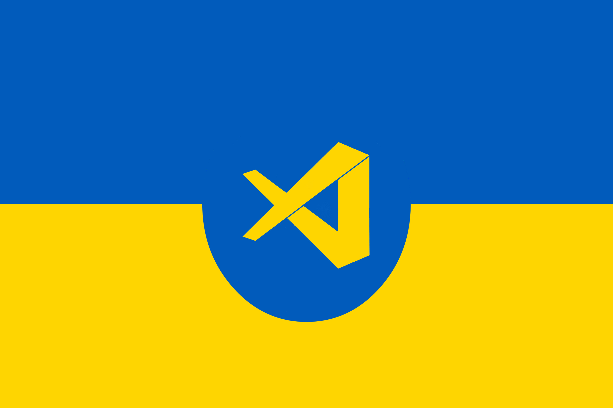

# Мовний пакет для української мови для VS Code

Мовний пакет для української мови містить локалізацію інтерфейсу VS Code.

## Встановлення та підключення
Перегляньте відеоінструкцію про те, як локалізувати VS Code українською, за цим посиланням: https://youtu.be/7Lgw5MRl6KM  

### Крок 1: Завантаження файлу

1. Перейдіть до сторінки релізу на GitHub:  
   [https://github.com/ovcharovcoder/vscode-language-pack-uk/releases/tag/v1.0.0](https://github.com/ovcharovcoder/vscode-language-pack-uk/releases/tag/v1.0.0).
2. Знайдіть файл `ovcharovcoder.vscode-language-pack-uk-1.0.0.vsix` у секції **Assets**.
3. Натисніть на назву файлу, щоб завантажити його на свій комп’ютер.

### Крок 2: Встановлення в VS Code

1. Відкрийте Visual Studio Code.
2. У лівій панелі натисніть на **Extensions** (`Ctrl+Shift+X` або `Cmd+Shift+X` на Mac).
3. Натисніть на три крапки (`...`) у верхньому правому куті панелі розширень.
4. Виберіть **Install from VSIX**.
5. Вкажіть шлях до завантаженого файлу `ovcharovcoder.vscode-language-pack-uk-1.0.0.vsix` і натисніть **Відкрити**.

### Крок 3: Активація української мови

1. Натисніть `Ctrl+Shift+P` (або `Cmd+Shift+P` на Mac), щоб відкрити палітру команд.
2. Введіть `Configure Display Language` і виберіть цей пункт.
3. У списку виберіть `uk` (Українська) і підтвердіть вибір.
4. Перезавантажте VS Code, натиснувши **Restart**.

### Перевірка

Після перезавантаження інтерфейс VS Code стане україномовним.

## Сумісність

Пакет підтримує VS Code версії 1.97.0 і вище. Перевірте свою версію в меню **Довідка > Про програму**.

## Використання

Ви можете перевизначити мову інтерфейсу користувача за умовчанням, явно задавши мову відображення VS Code за допомогою команди «Налаштувати мову відображення».

Натисніть <kbd>Ctrl</kbd> + <kbd>Shift</kbd> + <kbd>P</kbd> (<kbd>Command ⌘</kbd> + <kbd>Shift ⇧</kbd> + <kbd>P</kbd> на Mac), щоб відфільтрувати команду «Налаштувати мову відображення» (“Configure Display Language”). Натисніть клавішу <kbd>Введення</kbd> (<kbd>Enter</kbd>), і відкриється список встановлених мов за мовними стандартами, в яких буде вибрано поточний мовний стандарт. Щоб змінити мову інтерфейсу користувача, виберіть інший мовний стандарт.

Додаткові відомості: [Документація](https://go.microsoft.com/fwlink/?LinkId=761051).

## Участь

Щоб надіслати відгук про покращення перекладу, створіть питання у репозиторії [vscode-loc](https://github.com/microsoft/vscode-loc).
Рядки перекладу знаходяться на платформі локалізації Майкрософт. Зміни можна внести лише на ній, а потім експортувати до репозиторію vscode-loc. Тому запити на витягування в репозиторії vscode-loc не прийматимуться.

## Ліцензія

На вихідний код та рядки поширюється ліцензія [MIT](https://github.com/Microsoft/vscode-loc/blob/master/LICENSE.md).

## Подяка

Мовний пакет для української мови доступний вам завдяки зусиллям спільноти.

Висловлюємо особливу вдячність тим, хто брав участь у створенні пакета.

**Учасники:**

- Андрій Овчаров

**Приємної роботи!**

